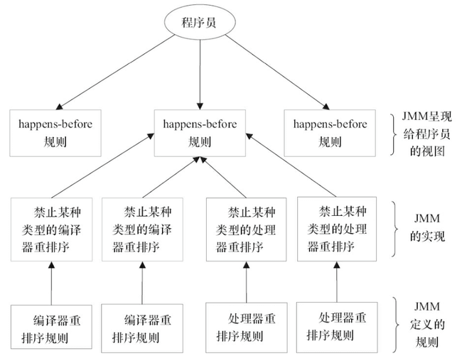

# Java内存模型(JMM)

## 引言

Java 内存模型（Java Memory Model，JMM）是 Java 虚拟机规范中定义的一种抽象概念，用于屏蔽各种硬件和操作系统的内存访问差异，保证 Java 程序在各种平台下都能达到一致的内存访问效果。JMM 的核心目标是解决多线程并发编程中的三大特性问题：原子性、可见性和有序性。

## 并发编程三特性

- **原子性（Atomicity）**：一个或多个操作要么全部执行成功，要么全部不执行，中间不会被其他线程打断
- **可见性（Visibility）**：一个线程对共享变量的修改，其他线程能够立即看到
- **有序性（Ordering）**：程序执行的顺序按照代码的先后顺序执行

## 物理层特性

### CPU 多级缓存

现代 CPU 为了提高执行效率，在处理器和主内存之间引入了多级缓存（L1、L2、L3）。CPU 多级缓存可以有效解决单线程操作的性能问题，但对于多线程操作共享变量时，就需要保障缓存一致性。

#### 缓存一致性协议

CPU 为了解决内存缓存不一致性问题，可以通过制定**缓存一致性协议**（比如 MESI 协议）或其他手段来解决。缓存一致性协议指的是在 CPU 高速缓存与主内存交互时需要遵守的原则和规范。不同的 CPU 中，使用的缓存一致性协议通常也会有所不同。

**MESI 协议**是一种广泛使用的缓存一致性协议，它定义了缓存行的四种状态：
- **M（Modified）**：缓存行已被修改，与主内存不一致，只存在于当前缓存中
- **E（Exclusive）**：缓存行只存在于当前缓存中，与主内存一致，未被修改
- **S（Shared）**：缓存行可能存在于多个 CPU 缓存中，与主内存一致
- **I（Invalid）**：缓存行无效，需要从主内存重新读取

通过状态转换和缓存间的消息传递，MESI 协议保证了多核 CPU 环境下的缓存一致性。

#### 可见性问题

**可见性**：一个线程对共享变量的修改，另外一个线程能够立刻看到。

```java
// 线程1执行的代码
int i = 0;
i = 10;  // 修改共享变量 i
 
// 线程2执行的代码
j = i;  // 读取共享变量 i
```

**问题分析**：假设线程1运行在 CPU1 上，线程2运行在 CPU2 上。当线程1执行 `i = 10` 时，会先把 i 的初始值加载到 CPU1 的高速缓存中，然后赋值为 10。此时 CPU1 的高速缓存中 i 的值变为 10，但可能尚未立即写回主内存。

此时线程2执行 `j = i`，它会从主内存读取 i 的值并加载到 CPU2 的缓存中。由于主内存中 i 的值仍然是 0，导致 j 的值为 0 而不是 10。

这就是**可见性问题**：线程1对变量 i 的修改，线程2没有立即看到。


### 指令重排

为了提高程序执行性能，编译器和处理器会对指令进行重排序优化。

#### 指令重排的方式

- **编译器优化重排**：编译器（包括 JVM、JIT 编译器等）在不改变单线程程序语义的前提下，重新安排语句的执行顺序
- **指令并行重排**：现代处理器采用了指令级并行技术（Instruction-Level Parallelism，ILP）来将多条指令重叠执行。如果不存在数据依赖性，处理器可以改变语句对应机器指令的执行顺序
- **内存系统重排**：由于处理器使用缓存和读写缓冲区，使得加载和存储操作看上去可能是乱序执行的

#### 指令重排的特点

- Java 源代码会经历 **编译器优化重排 → 指令并行重排 → 内存系统重排** 的过程，最终才变成操作系统可执行的指令序列
- 指令重排序可以保证**单线程串行语义一致**（as-if-serial），但不保证多线程间的语义也一致，所以在多线程下，指令重排序可能会导致问题

#### 内存屏障（Memory Barrier）

为了禁止指令重排序，需要使用**内存屏障**（Memory Barrier，也叫内存栅栏 Memory Fence）。内存屏障是一种 CPU 指令，它的作用有两个：

1. **保证特定操作的执行顺序**：禁止屏障两侧的指令重排序
2. **保证某些变量的内存可见性**：强制刷新缓存，使得修改立即对其他线程可见

常见的内存屏障类型：
- **LoadLoad 屏障**：确保屏障前的读操作先于屏障后的读操作
- **StoreStore 屏障**：确保屏障前的写操作先于屏障后的写操作
- **LoadStore 屏障**：确保屏障前的读操作先于屏障后的写操作
- **StoreLoad 屏障**：确保屏障前的写操作先于屏障后的读操作（开销最大）

禁止指令重排的方式：
- 对于编译器：通过禁止特定类型的编译器重排序来实现
- 对于处理器：通过插入内存屏障来禁止特定类型的处理器重排序

#### 有序性问题

**有序性**：程序执行的顺序按照代码的先后顺序执行。

```java
int i = 0;              
boolean flag = false;
i = 1;                // 语句1  
flag = true;          // 语句2
```

**问题分析**：上面代码定义了一个 int 型变量和一个 boolean 类型变量，然后分别对两个变量进行赋值操作。从代码顺序上看，语句1在语句2前面，但 JVM 在真正执行这段代码时会保证语句1一定在语句2前面执行吗？

答案是：**不一定**。因为这里可能会发生**指令重排序**（Instruction Reorder）。在单线程环境下，由于语句1和语句2之间没有数据依赖关系，即使发生重排序也不会影响程序结果。但在多线程环境下，如果其他线程依赖这两个变量之间的执行顺序，指令重排序就可能导致程序出现意外的结果。

### CPU 分时复用

现代操作系统采用**分时复用**（Time Sharing）机制来实现多任务并发执行。CPU 分时复用是指多个线程（或进程）共享 CPU 资源，通过时间片轮转的方式交替执行。操作系统会为每个线程分配一个时间片（通常是几毫秒到几十毫秒），当线程的时间片用完后，操作系统会进行**上下文切换**（Context Switch），保存当前线程的执行状态，然后切换到另一个线程继续执行。

**CPU 分时复用的特点**：
- **时间片轮转**：每个线程获得一小段 CPU 执行时间，时间片用完后切换到下一个线程
- **上下文切换**：线程切换时需要保存和恢复寄存器、程序计数器等上下文信息，存在一定开销
- **并发执行**：从宏观上看，多个线程同时执行；从微观上看，CPU 在不同线程间快速切换

这种机制使得单核 CPU 也能实现"同时"运行多个程序的效果，但也带来了多线程并发编程中的**原子性问题**。

#### 原子性问题

**原子性**：一个操作或者多个操作要么全部执行且执行过程不会被任何因素打断，要么就都不执行。

```java
int i = 1;

// 线程1执行
i += 1;  // 期望结果：i = 2

// 线程2执行
i += 1;  // 期望结果：i = 3
```

**问题分析**：这里需要注意，`i += 1` 并不是原子操作，它需要三条 CPU 指令：

1. 将变量 i 从内存读取到 CPU 寄存器
2. 在 CPU 寄存器中执行 i + 1 操作
3. 将最后的结果 i 写回内存（可能先写入 CPU 缓存，再同步到主内存）

由于 **CPU 分时复用**（线程切换）的存在，可能会出现以下执行序列：
1. 线程1读取 i = 1 到寄存器
2. **发生线程切换**，切换到线程2
3. 线程2读取 i = 1 到寄存器，执行加1操作，写回 i = 2
4. **切换回线程1**
5. 线程1继续执行加1操作（基于之前读取的值1），写回 i = 2

最终结果是 i = 2 而不是期望的 3，这就是**原子性问题**。


## Java 内存模型（JMM）规范

Java 具有跨平台的特性，为了屏蔽各种硬件和操作系统的内存访问差异，Java 基于物理层面的 CPU 缓存模型，制定了 **Java 内存模型（JMM）** 的操作规范。JMM 的核心是 **happens-before 原则**，它定义了多线程程序中操作之间的偏序关系，保证了内存可见性。


### Happens-Before 原则

**Happens-Before** 是 JMM 中最核心的概念，如果操作 A happens-before 操作 B，那么操作 A 的结果对操作 B 可见。JMM 定义了以下八条 happens-before 规则：

#### 1. 程序次序规则（Program Order Rule）
单线程内，按照控制流顺序，前面的操作 happens-before 后面的操作（遵循 as-if-serial 语义）。

```java
int a = 1;  // 操作1
int b = 2;  // 操作2  happens-before 关系：操作1 h-b 操作2
```

#### 2. 管程锁定规则（Monitor Lock Rule）
对同一个锁的解锁操作 happens-before 后续对该锁的加锁操作。

```java
synchronized(lock) {
    // 释放锁 happens-before 下一次对该锁的获取
}
```

#### 3. volatile 变量规则（Volatile Variable Rule）
对同一个 volatile 变量的写操作 happens-before 后续的读操作。

```java
volatile boolean flag = false;
// 线程1：写操作 happens-before 线程2的读操作
flag = true;
```

#### 4. 线程启动规则（Thread Start Rule）
Thread.start() 的调用 happens-before 该线程内的任意操作。

```java
Thread t = new Thread(() -> {
    // start() 调用 happens-before 这里的所有操作
});
t.start();
```

#### 5. 线程终止规则（Thread Termination Rule）
线程内的所有操作 happens-before 其他线程检测到该线程终止（如 join() 返回、Thread.isAlive() 返回 false）。

```java
t.join();  // t 线程中的所有操作 happens-before join() 返回
```

#### 6. 线程中断规则（Thread Interruption Rule）
对线程的中断操作 happens-before 该线程检测到中断事件的发生（如 Thread.interrupted()、InterruptedException 抛出）。

#### 7. 传递性规则（Transitivity）
如果操作 A happens-before 操作 B，且操作 B happens-before 操作 C，则操作 A happens-before 操作 C。

#### 8. 对象终结规则（Finalizer Rule）
对象的构造函数执行完成 happens-before 该对象的 finalize() 方法的开始。


### Happens-Before 与 JMM 的关系

Happens-Before 原则是 JMM 对开发者的承诺：只要遵循这些规则，JMM 就保证程序的正确性和可见性，无需关心底层硬件差异。



## Java 并发关键字

Java 提供了两个重要的关键字来解决并发编程中的三大特性问题：`volatile` 和 `synchronized`。

### volatile 关键字

`volatile` 是 Java 提供的一种**轻量级的同步机制**，它保证了**可见性**和**有序性**，但不保证原子性。

#### 功能特性

1. **保证可见性**：对 volatile 变量的写操作会立即刷新到主内存，读操作会直接从主内存读取，不使用工作内存的缓存副本
2. **禁止指令重排序**：通过插入内存屏障来禁止编译器和处理器对 volatile 变量相关的指令进行重排序

#### 底层实现原理

volatile 通过**内存屏障**来实现其语义：

- **写操作**：在 volatile 写操作前插入 StoreStore 屏障，之后插入 StoreLoad 屏障，确保写操作不会被重排序，且立即刷新到主内存
- **读操作**：在 volatile 读操作后插入 LoadLoad 屏障和 LoadStore 屏障，确保读操作获取到最新值，且后续操作不会被重排序到读操作之前

#### 使用场景

```java
// 1. 状态标志
volatile boolean flag = false;

// 2. 双重检查锁定（DCL）中的单例对象
public class Singleton {
    private volatile static Singleton instance;
    
    public static Singleton getInstance() {
        if (instance == null) {  // 第一次检查
            synchronized (Singleton.class) {
                if (instance == null) {  // 第二次检查
                    instance = new Singleton();  // volatile 防止指令重排
                }
            }
        }
        return instance;
    }
}

// 3. 独立观察者模式（一个线程写，多个线程读）
volatile long sharedValue;
```

#### 注意事项

- volatile **不能保证原子性**，对于复合操作（如 `count++`）需要使用 synchronized 或原子类
- 适用于一个线程写、多个线程读的场景
- 性能开销比 synchronized 小

### synchronized 关键字

`synchronized` 是 Java 提供的一种**重量级的同步机制**，它可以保证**原子性**、**可见性**和**有序性**。

#### 功能特性

1. **保证原子性**：同一时刻只有一个线程能进入 synchronized 代码块，保证操作的原子性
2. **保证可见性**：解锁时会把线程本地缓存的修改同步到主内存，加锁时会清空本地缓存、重新从主内存加载数据
3. **保证有序性**：在同步代码块内部遵循 happens-before 原则，解锁操作 happens-before 后续的加锁操作

#### 使用方式

```java
// 1. 修饰实例方法（锁对象是 this）
public synchronized void method() {
    // 临界区代码
}

// 2. 修饰静态方法（锁对象是 Class 对象）
public static synchronized void staticMethod() {
    // 临界区代码
}

// 3. 修饰代码块（可以指定锁对象）
public void method() {
    synchronized (lock) {
        // 临界区代码
    }
}
```

#### 锁优化机制

JVM 对 synchronized 进行了多种优化，以提高性能：

1. **偏向锁（Biased Locking）**：当只有一个线程访问同步代码块时，锁会偏向该线程，减少无竞争情况下的开销
2. **轻量级锁（Lightweight Locking）**：当有少量线程竞争时，使用 CAS 操作来获取锁，避免线程阻塞
3. **重量级锁（Heavyweight Locking）**：当竞争激烈时，升级为重量级锁，线程阻塞等待
4. **锁消除（Lock Elimination）**：JIT 编译器可以消除不可能存在竞争的锁
5. **锁粗化（Lock Coarsening）**：将多个连续的加锁解锁操作合并为一个更大范围的锁

#### 使用场景

- 需要保证原子性的复合操作
- 多个线程同时读写共享变量
- 需要保证一段代码的互斥执行

### volatile vs synchronized

| 特性 | volatile | synchronized |
|------|----------|--------------|
| 原子性 | ❌ 不保证 | ✅ 保证 |
| 可见性 | ✅ 保证 | ✅ 保证 |
| 有序性 | ✅ 保证（禁止重排序） | ✅ 保证 |
| 适用范围 | 变量 | 方法、代码块 |
| 阻塞 | 不阻塞 | 可能阻塞 |
| 性能 | 轻量级，性能较好 | 重量级，性能开销较大 |
| 使用场景 | 状态标志，一写多读 | 复合操作，多线程竞争 |

## 总结

Java 内存模型（JMM）是 Java 并发编程的理论基础，它通过规范化的方式解决了并发编程中的三大核心问题：

### 三大特性与解决方案

1. **可见性问题**
   - **产生原因**：CPU 多级缓存导致线程间数据不可见
   - **解决方案**：使用 `volatile` 关键字或 `synchronized` 关键字，强制数据在主内存和工作内存之间同步

2. **有序性问题**
   - **产生原因**：编译器和处理器的指令重排序优化
   - **解决方案**：通过内存屏障禁止指令重排序，`volatile` 和 `synchronized` 都能提供有序性保证

3. **原子性问题**
   - **产生原因**：CPU 分时复用导致操作被中断
   - **解决方案**：使用 `synchronized` 关键字或原子类（如 `AtomicInteger`）保证操作的原子性

### JMM 的核心价值

- **屏蔽硬件差异**：通过统一的内存模型规范，使 Java 程序在不同平台上保持一致的行为
- **Happens-Before 原则**：为开发者提供了清晰的内存可见性保证，无需关注底层实现细节
- **提供同步工具**：`volatile`、`synchronized`、`Lock` 等工具让开发者能够安全地编写并发程序

### 最佳实践建议

1. **优先使用成熟的并发工具**：如 `java.util.concurrent` 包中的并发容器和工具类
2. **正确选择同步机制**：
   - 简单的状态标志使用 `volatile`
   - 复合操作或需要互斥的场景使用 `synchronized` 或 `Lock`
   - 计数器等简单操作使用原子类
3. **遵循 Happens-Before 原则**：合理利用规则来保证程序的正确性
4. **减少锁的范围**：尽量缩小同步代码块的范围，提高并发性能
5. **避免过度同步**：在不需要同步的场景使用同步机制会降低性能

理解 JMM 是编写高质量并发程序的基础，它帮助我们在保证线程安全的同时，充分利用多核处理器的性能优势。

