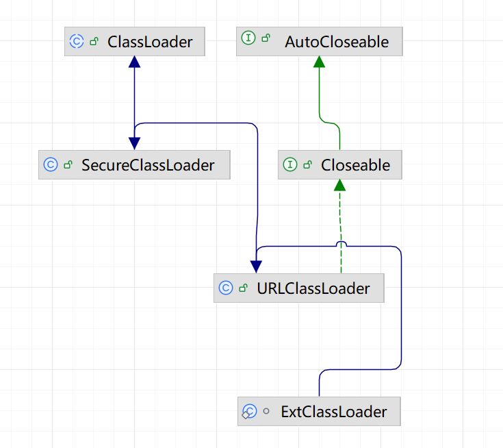
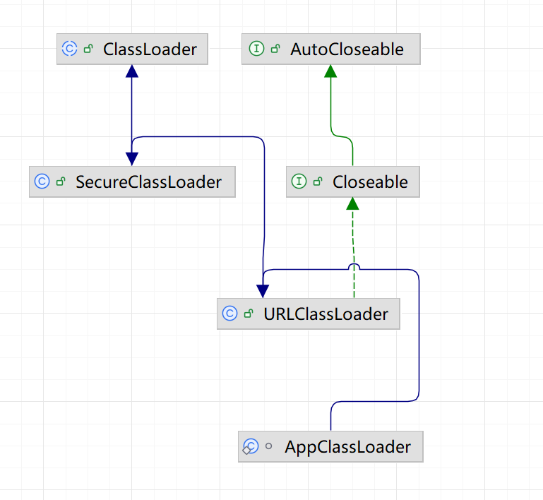

# 类加载机制

## 类加载过程


#### 1. 加载（Loading）

**核心作用**：找到目标类的`.class`字节流，加载到JVM内存，生成代表该类的`java.lang.Class`对象（作为访问类数据的入口）。

**具体执行步骤**：
1. **获取字节流**：通过类的全限定名（如`com.example.User`），从不同来源读取`.class`字节流（常见来源：本地硬盘、jar包、网络、动态生成（如动态代理）、数据库等）。
2. **转化存储结构**：将字节流的静态存储结构（.class文件格式）转化为JVM**方法区**的运行时数据结构（存储类的元数据：字段、方法、常量池等）。
3. **生成Class对象**：在**堆内存**中创建一个`Class`对象（唯一标识该类），作为程序访问方法区中类数据的“接口”。

**示例场景**：当你执行`new User()`时，JVM先检查`User`类是否已加载，若未加载则先执行加载阶段。

#### 2. 验证（Verification）

**核心作用**：校验加载的`.class`文件是否符合JVM规范，排除恶意/非法字节码，保证运行安全。

**四大校验维度**（按执行顺序）：

| 校验类型       | 校验内容                                                                 |
|----------------|--------------------------------------------------------------------------|
| 文件格式验证   | 校验字节流的基础格式（如魔数是否为`0xCAFEBABE`、版本号是否兼容JVM、字节码长度合法等）。 |
| 元数据验证     | 语义校验类的元数据（如类是否有父类、是否继承了`final`类、方法参数/返回值类型合法等）。|
| 字节码验证     | 校验方法体的字节码指令（如栈操作是否合法、类型转换是否安全、避免栈溢出/空指针等）。|
| 符号引用验证   | 校验常量池中的符号引用（如引用的类/方法/字段是否存在、权限是否足够）。|

**异常提示**：若验证失败，JVM会抛出`VerifyError`（或其子类，如`NoClassDefFoundError`），程序直接终止。

#### 3. 准备（Preparation）

**核心作用**：为类的**静态变量（类变量，static修饰）** 在方法区分配内存，并设置**默认初始值（零值）**。

**关键注意点**：

1. **仅处理静态变量**：实例变量（非static）的内存分配在对象实例化时（new）进行，不在此阶段处理。
2. **初始值是“零值”**：静态变量会被赋JVM默认值，而非代码中定义的初始值。
    - 基本类型零值：`int→0`、`boolean→false`、`long→0L`；
    - 引用类型零值：`null`。
3. **final静态常量例外**：如果是`static final`修饰的常量（编译期常量），此阶段会直接赋代码中定义的初始值（如`public static final int NUM = 10`，准备阶段`NUM`直接设为10）。


#### 4. 解析（Resolution）

**核心作用**：将方法区常量池中的**符号引用**转化为**直接引用**（内存地址）。

- **符号引用**：用一组符号描述目标（如类的全限定名、方法名+参数类型），与内存布局无关（编译期就能确定）；
- **直接引用**：直接指向目标的内存地址/偏移量，与内存布局绑定（运行时才能确定）。

**解析对象**：类/接口、字段、类方法、接口方法、方法句柄等。

**灵活执行**：解析阶段不是必须在准备后立即执行，JVM可在“需要时”（如执行到调用方法的指令时）才解析（动态解析），目的是支持Java的**动态绑定（多态）**。

#### 5. 初始化（Initialization）

执行真正的赋值和静态代码块

**核心作用**：执行类的初始化方法`<clinit>()`，为静态变量赋代码中定义的初始值，执行静态代码块（`static{}`）。

**关键特性**：
1. **<clinit>()方法的生成**：由编译器自动收集类中所有静态变量的赋值语句和静态代码块，按代码书写顺序合并生成（无需手动定义）。
2. **执行顺序**：父类的`<clinit>()`先于子类执行（因此父类的静态代码块/静态变量赋值会先完成）。
3. **触发条件**：仅当类被**主动使用**时才会触发初始化（被动使用不触发），主动使用场景包括：
    - 创建类的实例（`new`、反射、克隆、反序列化）；
    - 调用类的静态方法；
    - 访问类的非final静态变量；
    - 反射调用（如`Class.forName("com.example.User")`）；
    - 初始化子类时，父类会先初始化（除非子类仅访问父类的final静态变量）；
    - JVM启动时指定的主类（包含`main()`方法的类）。

## 类加载器


类加载器有两种，一种是JVM内置，C++实现的Bootstrap Classloader，另一种是承自java.lang.ClassLoader，
使用java实现的类加载器，包括官方实现的Extension ClassLoader，Application ClassLoader, 以及用户可能自定义的类加载器

### Bootstrap Classloader

Bootstrap ClassLoader 默认加载 <JAVA_HOME>/jre/lib 目录下的核心 jar 包（如rt.jar、charsets.jar、sunrsasign.jar等），
这些 jar 包包含了 Java 核心类（如java.lang.String、java.lang.Object、java.util.ArrayList等）

由于 Bootstrap ClassLoader 是原生代码实现，并非 Java 对象，因此在 Java 代码中获取核心类的类加载器时，返回值为null

如果rt.jar缺失或损坏，Bootstrap ClassLoader 无法加载核心类，JVM 会直接启动失败，抛出NoClassDefFoundError

查看Bootstrap ClassLoader 加载路径
```
package com.yggdrasil.learn.classloader;

import java.io.File;

public class BootstrapClassLoaderTest {
    public static void main(String[] args) {
        // 获取Bootstrap ClassLoader的加载路径（系统属性）
        String bootClassPath = System.getProperty("sun.boot.class.path");
        // 按系统路径分隔符拆分（Windows是;，Linux/Mac是:）
        String[] paths = bootClassPath.split(File.pathSeparator);

        System.out.println("Bootstrap ClassLoader 加载路径：");
        for (String path : paths) {
            System.out.println(path);
        }
    }
}

```

输出
```
Bootstrap ClassLoader 加载路径：
C:\Program Files\Java\jdk1.8.0_333\jre\lib\resources.jar
C:\Program Files\Java\jdk1.8.0_333\jre\lib\rt.jar
C:\Program Files\Java\jdk1.8.0_333\jre\lib\sunrsasign.jar
C:\Program Files\Java\jdk1.8.0_333\jre\lib\jsse.jar
C:\Program Files\Java\jdk1.8.0_333\jre\lib\jce.jar
C:\Program Files\Java\jdk1.8.0_333\jre\lib\charsets.jar
C:\Program Files\Java\jdk1.8.0_333\jre\lib\jfr.jar
C:\Program Files\Java\jdk1.8.0_333\jre\classes
```

### Extension ClassLoader



Extension ClassLoader具体指的是 sun.misc.Launcher$ExtClassLoader,
ExtClassLoader主要负责加载 %JRE_HOME%/lib/ext 目录下的 jar 包和类以及被 java.ext.dirs 系统变量所指定的路径下的所有类。

### Application ClassLoader



Application ClassLoader具体指的是 sun.misc.Launcher$AppClassLoader,

AppClassLoader(应用程序类加载器)：面向我们用户的加载器，负责加载当前应用 classpath 下的所有 jar 包和类。

## 双亲委派机制


当一个类加载器需要加载某个类时，它不会先自己动手，而是先把这个“加载请求”交给自己的**父类加载器**去处理；父类加载器也会重复这个行为，直到请求传到最顶层的类加载器； 
只有当顶层加载器无法加载这个类时，请求才会“向下回退”，由子类加载器自己尝试加载。

这里的“双亲”并不是指父类和母类，而是指**父级类加载器**（是组合关系，不是继承关系）。


### 双亲委派的核心实现（ClassLoader源码解析）

```java
protected Class<?> loadClass(String name, boolean resolve) throws ClassNotFoundException {
    synchronized (getClassLoadingLock(name)) {
        // 1. 先检查这个类是否已经被加载过（缓存）
        Class<?> c = findLoadedClass(name);
        if (c == null) {
            long t0 = System.nanoTime();
            try {
                // 2. 如果有父加载器，委派给父加载器加载
                if (parent != null) {
                    c = parent.loadClass(name, false);
                } else {
                    // 3. 没有父加载器（说明是Bootstrap），直接找Bootstrap加载
                    c = findBootstrapClassOrNull(name);
                }
            } catch (ClassNotFoundException e) {
                // 父加载器加载失败，捕获异常（不抛出）
            }

            // 4. 父加载器加载失败，自己尝试加载
            if (c == null) {
                long t1 = System.nanoTime();
                // findClass是自定义加载器需要重写的方法（核心加载逻辑）
                c = findClass(name);
            }
        }
        // 5. 解析类（可选）
        if (resolve) {
            resolveClass(c);
        }
        return c;
    }
}
```

### 双亲委派机制的核心作用
1. **保证类的唯一性**：避免同一个类被不同加载器重复加载。比如`java.lang.String`只会被Bootstrap加载，无论哪个子类加载器请求，最终都是顶层加载，保证JVM中只有一个`String`类的Class对象。
2. **保护核心API安全**：防止核心类被篡改。比如你自定义一个`java.lang.String`类，由于双亲委派，请求会先到Bootstrap加载器，它会加载核心库的`String`，而不会加载你自定义的，避免恶意替换核心类。
3. **遵循类加载的优先级**：核心类（JDK自带）优先加载，应用类后加载，符合Java的设计逻辑。

### 打破双亲委派的场景
双亲委派不是强制规则，某些场景下会被打破（重写`loadClass()`方法）：
- **SPI机制**：比如JDBC驱动加载（`java.sql.Driver`），核心类`DriverManager`由Bootstrap加载，但它需要加载应用中的驱动类，因此通过`Thread.currentThread().getContextClassLoader()`获取应用类加载器，打破委派；
- **Tomcat类加载**：Tomcat为了实现不同Web应用的类隔离，自定义了类加载器，打破了双亲委派；
- **OSGi框架**：为了实现模块化热部署，也会自定义类加载逻辑。