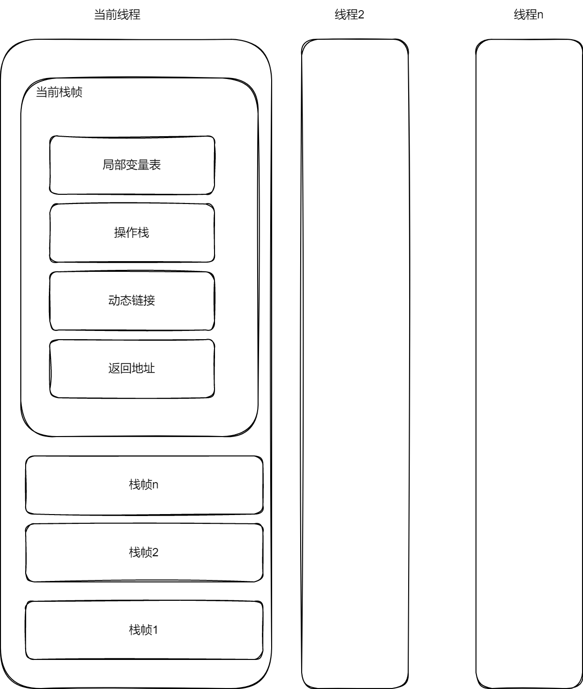
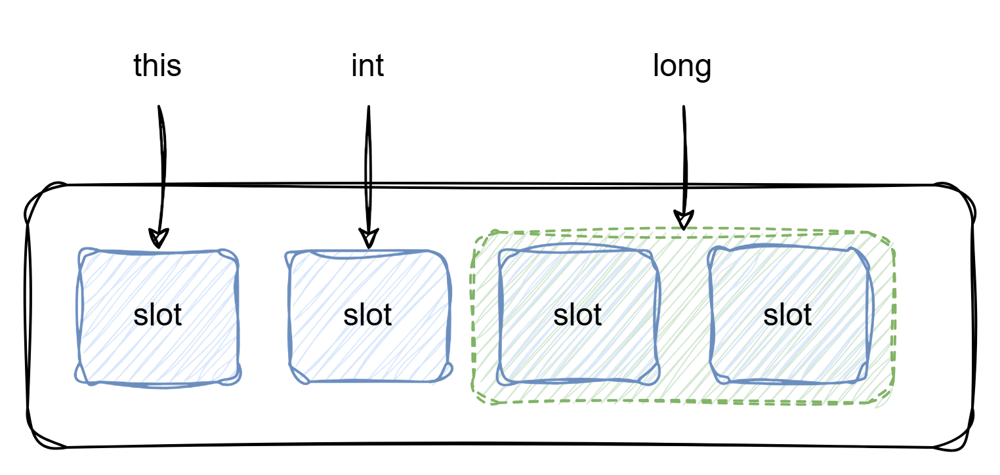

# 虚拟机栈

Java虚拟机通过虚拟机栈的形式运行方法，虚拟机栈是一个后进先出（LIFO）栈结构，对应的是多个方法之间的调用逻辑。

虚拟机栈中的栈帧结构是对应方法内容的结构化设计，栈帧中的局部变量表是数据的“存储”模块，操作数栈是数据的“运算”模块。方法的运行本质是数据处理，也就是存取和运算。

方法调用其他方法，或者成员变量是对象的时候，栈帧存的是符号引用，运行时要转成直接引用，就是动态链接（支持多态），编译时就能确定的是静态链接，如静态方法。

当前方法执行完后，要回到调用者的哪个位置继续执行，需要提供返回地址，返回地址指向的就是当前方法的下一行代码执行的地址



## 局部变量表
局部变量表是一种“数据存储结构”，可以看作一个元素是Slot的列表

局部变量表存储的包括方法的参数和方法声明的局部变量

**Slot存储**
局部变量表槽位（Slot） 为基本单位，每个 Slot 占 4 字节；

1 个 Slot 存储：boolean/byte/char/short/int/float/reference/returnAddress；

2 个连续 Slot 存储：long/double（64 位类型）；

局部变量表的大小（Slot 数）由字节码的max_locals属性决定，编译期固定，运行期不可扩容。

对于int 类型，在32位系统占4字节，一个Slot，在64位系统占4字节，使用低4字节，高4字节置 0（HotSpot 内部做了对齐处理），也是一个Slot，

对于long 类型，在32位系统占8字节，两个Slot，在64位系统8字节，使用低4字节，高4字节置 0（HotSpot 内部做了对齐处理），也是两个个Slot，

对于引用类型，在32位系统占4字节，一个Slot，在64位系统占8字节，也是一个Slot

由此可见，所谓Slot是一种固定设计的模式，底层操作系统JVM做了兼容处理

局部变量表不可能存对象本体，逃逸技术用的是标量替换的方式，拆解对象为标量

从局部变量表的特点，int类型会比integer类型开销更低（当然，JVM会有优化，但不可能完全等同效果）

**Slot顺序**
实例方法：
第一个 Slot（index=0）固定存储this引用（指向当前对象），这是 JVM 规范的强制要求；
从 index=1 开始，按方法参数的声明顺序依次分配 Slot（参数 1→index1，参数 2→index2，依此类推）。

静态方法：
无this引用，参数从 index=0 开始，按声明顺序分配 Slot。

**Slot复用**
```
public void reuseSlot() {
    {
    int x = 10; // 分配index0（假设是静态方法，无this）
    System.out.println(x);
    } // x作用域结束，Slot0可复用

    {
        String y = "test"; // 复用x的Slot0，而非分配index1
        System.out.println(y);
    } // y作用域结束，Slot0可复用
    
    double z = 3.14; // 占用Slot0、1（复用之前的Slot0，新增Slot1）
}
```

局部变量表中的引用是 GC Roots（垃圾回收根节点），如果一个大对象的引用变量作用域结束，但它占用的 Slot 未被复用，该引用会一直存在，导致对象无法被 GC；只有 Slot 被新变量复用（覆盖引用），原对象才失去 GC Roots 关联，才有机会被回收。

如果一个局部变量声明了，但是没有赋值，也没有使用，会在编译期间优化掉




## 操作数栈

操作数栈是一种“数据运算结构”

### 一、操作数栈的大小是「编译期确定」的，且不可动态扩容
这是操作数栈和普通内存栈（如Java的`Stack`类）最核心的区别之一：
- **编译期确定最大深度**：Java代码编译成字节码时，编译器会计算出每个方法执行时操作数栈需要的「最大深度」（字节码中`stack=2`就是指最大深度为2）；
- **栈帧创建时一次性分配**：方法调用创建栈帧时，JVM会根据这个预计算的深度，为操作数栈分配连续的内存空间（栈槽，Slot），运行时**不会动态扩容**；
- **溢出后果**：若运行时操作数栈实际使用深度超过编译期确定的最大值，会直接抛出`StackOverflowError`（注意：和JVM栈的栈溢出是不同场景，但异常类型相同）。

**例子**：
```java
// 编译后字节码中stack=3（因为(1+2)*(3-4)的最大栈深度是3）
public static int nestedCalc() {
    return (1 + 2) * (3 - 4);
}
```
**核心意义**：编译期确定大小避免了运行时的内存扩容开销（如数组扩容的复制操作），保证了栈操作的O(1)性能，也让JVM的内存管理更简单。

### 二、long/double类型会占用「两个栈槽」，需特殊处理
操作数栈的基本存储单元是「栈槽（Slot）」，默认每个栈槽占4字节（可存储int/float/引用类型），但：
- `long`（8字节）和`double`（8字节）会占用**两个连续的栈槽**；
- 操作这类类型时，JVM会一次性操作两个栈槽（入栈时压入两个槽，出栈时弹出两个槽），不允许单独操作其中一个槽；
- 字节码指令后缀为`l`（long）/`d`（double），如`lconst_1`（long常量1入栈）、`dadd`（double加法）。

**例子（long运算）**：
```java
public static long longAdd() {
    long a = 1L;
    long b = 2L;
    return a + b;
}
```
**核心字节码+栈变化**：
```
0: lconst_1        // long 1入栈（占用2个槽，栈状态：[1L(槽0+1)]）
1: lstore_0        // 弹出1L，存入局部变量表0+1（long占两个局部变量槽）
2: lconst_2        // long 2入栈（栈状态：[2L(槽0+1)]）
3: lstore_2        // 弹出2L，存入局部变量表2+3
4: lload_0         // 1L从局部变量表压入栈（栈：[1L]）
5: lload_2         // 2L压入栈（栈：[1L, 2L]）
6: ladd            // 弹出两个long，相加得3L，压回栈（占2个槽）
7: lreturn         // 返回3L
```
**坑点提醒**：若操作数栈中混合了单槽（int）和双槽（long）类型，JVM会严格校验栈槽的使用，避免“槽错位”导致的数据错误。

### 三、操作数栈是「值传递」，与局部变量表无引用关联
操作数栈和局部变量表之间的数据交互（`iload`/`istore`）是**复制值**，而非引用：
- 把局部变量压入栈：是将变量的「值拷贝」到栈槽，栈中修改该值，不会影响局部变量；
- 把栈顶值存入局部变量：是将栈值的「拷贝」写入局部变量表，原栈值弹出后消失。

**例子验证**：
```java
public static int valueCopy() {
    int a = 1;
    // 压栈→修改栈值（仅演示逻辑，实际字节码无法直接修改栈值）
    // 栈：[1] → 假设手动改栈值为10 → 栈：[10]
    // 弹出栈值存入b，a仍为1
    int b = a; 
    return b; // 返回1，而非10
}
```
**核心意义**：值传递保证了操作数栈的「独立性」，运算过程中的中间结果不会意外污染局部变量，也简化了JVM的内存管理（无需处理引用依赖）。

### 四、JIT编译器对操作数栈的「栈折叠优化」（性能核心）
解释执行时，操作数栈的压栈/出栈是内存操作，性能较低，但JIT编译器会对栈操作做「栈折叠（Stack Collapsing）」优化：
- **核心逻辑**：消除冗余的压栈/出栈操作，直接将栈操作映射为局部变量或寄存器操作；
- **例子**：
  解释执行时的字节码：`iload_0 → iload_1 → iadd`（压a→压b→相加）；
  JIT编译后：直接取局部变量表的a和b，在CPU寄存器中相加（`add eax, ebx`），完全跳过栈操作；
- **极端情况**：若方法内的运算逻辑简单（如`a+b`），JIT会把操作数栈的所有操作“折叠”成直接的寄存器运算，栈操作相当于“被优化消失”。

**核心意义**：这也是JVM敢用“性能稍低”的栈模型的关键——解释执行保证跨平台，JIT的栈折叠则把性能拉回硬件寄存器级别。

### 五、特殊指令：dup/swap（操作数栈的“辅助操作”）
JVM提供了专门操作栈顶元素的指令，用于处理“重复使用操作数”或“调整操作数顺序”的场景，核心是：

| 指令 | 作用 | 例子（栈状态变化） |
|------|------|--------------------|
| `dup` | 复制栈顶元素，压回栈 | 栈：[1] → dup → [1, 1] |
| `dup_x1` | 复制栈顶元素，插入到栈顶第二个元素下方 | 栈：[a, b] → dup_x1 → [b, a, b] |
| `swap` | 交换栈顶两个元素（仅支持单槽类型） | 栈：[1, 2] → swap → [2, 1] |

**典型应用：对象创建+构造方法调用**
```java
// new Object()的字节码逻辑
0: new           #2                  // 创建Object对象，引用压栈：[obj@xxx]
3: dup                               // 复制引用：[obj@xxx, obj@xxx]
4: invokespecial #1                  // 弹出一个引用，调用构造方法，栈剩余：[obj@xxx]
7: astore_0                          // 弹出引用，存入局部变量表
```
**为什么需要dup**：`new`指令创建对象后，引用压栈；构造方法（`invokespecial`）会弹出引用执行初始化，若不复制，初始化后栈中就没有对象引用了——`dup`保证了“初始化后仍能拿到对象引用”。

### 六、操作数栈的「线程私有性」与异常处理
1. **线程私有**：每个线程有独立的JVM栈，每个栈帧的操作数栈也是线程私有的，不存在多线程竞争问题，天然线程安全；
2. **异常时的栈清理**：当方法抛出未捕获的异常时，JVM会销毁当前栈帧，同时清理操作数栈的内存（栈槽的值被置空），避免内存泄漏；
3. **异常表与栈状态**：字节码的异常表会记录“异常处理的起始/结束位置”，JVM跳转到异常处理代码时，会保证操作数栈的状态符合处理代码的要求（如仅保留异常对象的引用）。


### 七、代码运行示例
```Java
public class StackOperandTest {
    public static int add() {
        int a = 1;   // 局部变量表索引0
        int b = 1;   // 局部变量表索引1
        return a + b;
    }
}
```

```
  public static int add();
    Code:
      stack=2, locals=2, args_size=0
         0: iconst_1        // 把常量1压入栈
         1: istore_0        // 弹出栈顶1，存入局部变量表索引0（a）
         2: iconst_1        // 把常量1压入栈
         3: istore_1        // 弹出栈顶1，存入局部变量表索引1（b）
         4: iload_0         // 把局部变量表0的1压入栈
         5: iload_1         // 把局部变量表1的1压入栈
         6: iadd            // 弹出栈顶两个1，相加后压回2
         7: ireturn         // 弹出栈顶2，作为返回值
```

## 动态链接


### 符号引和直接引用：
  - 符号引用：Class文件中存储的是“符号形式”的引用（比如方法名、类名、字段名的字符串描述，例如`com.example.Animal.eat()`），它不指向内存中的实际地址，只是一个“标识”；
  - 直接引用：指向内存中实际地址的引用（比如指向方法区中方法字节码的指针、内存偏移量），是可以直接使用的“物理地址”。

### 动态链接是什么
动态链接（也叫“运行时常量池的解析”）是指：**栈帧中会保存一个指向运行时常量池中当前方法的符号引用，在方法执行过程中（尤其是调用其他方法时），JVM会将这个符号引用实时解析为直接引用的过程**。

简单来说：动态链接就是“运行时把‘符号名字’换成‘实际内存地址’”的过程。

Java是面向对象的语言，核心特性之一是**多态（动态分派）**，而动态链接正是支撑多态的关键机制。

#### 静态链接和动态链接
JVM的方法引用解析分为两种：

| 特性         | 静态链接（早期解析）| 动态链接（晚期解析）|
|--------------|---------------------------------|---------------------------------|
| 解析时机     | 类加载的“解析阶段”（类初始化前） | 方法**第一次被调用时**（运行时） |
| 适用方法     | 非虚方法（静态方法、私有方法、final方法、构造方法） | 虚方法（普通成员方法、接口方法） |
| 绑定方式     | 编译时绑定（静态分派）| 运行时绑定（动态分派）|
| 核心目的     | 提前解析，提升执行效率          | 支持多态，动态确定调用目标      |


```java
// 父类
class Animal {
    public void eat() {
        System.out.println("动物吃饭");
    }
}

// 子类
class Cat extends Animal {
    @Override
    public void eat() {
        System.out.println("猫吃小鱼干");
    }
}

public class Test {
    public static void main(String[] args) {
        Animal a = new Cat();
        a.eat(); // 运行时输出“猫吃小鱼干”
    }
}
```
- 编译阶段：编译器只能确定调用的是`Animal.eat()`的**符号引用**（因为编译时无法知道`a`实际指向`Cat`），字节码中会生成`invokevirtual`指令，指向这个符号引用；
- 运行阶段：当执行`a.eat()`时，JVM通过**动态链接**，将`Animal.eat()`的符号引用解析为`Cat.eat()`的直接引用（指向内存中`Cat`类`eat`方法的实际地址），最终执行子类的方法——这就是动态链接支撑多态的过程。

### 动态链接的实现细节
1. **解析过程**：
  - 当执行到方法调用指令（如`invokevirtual`、`invokeinterface`）时，JVM先检查该符号引用是否已解析为直接引用；
  - 如果未解析：从运行时常量池中找到该符号引用对应的类/方法，验证访问权限后，将其解析为直接引用，并**缓存**（后续调用无需重复解析）；
  - 如果已解析：直接使用缓存的直接引用执行方法。
2. **线程安全性**：动态链接是线程私有的（因为虚拟机栈是线程私有），不同线程解析同一个符号引用不会互相干扰，无需加锁。
3. **缓存机制**：解析后的直接引用会缓存到运行时常量池的对应条目里，避免每次调用都重复解析，平衡“动态性”和“执行效率”。

### 动态链接的特点
1. **延迟解析**：不是类加载时一次性解析所有符号引用，而是“用的时候才解析”，符合Java“懒加载”的设计思想；
2. **动态绑定**：运行时才确定最终调用的方法，是多态的底层核心；
3. **效率平衡**：首次解析有轻微开销，但缓存机制保证后续调用无额外成本。

## 返回地址
TODO


## 虚拟机栈执行流程

### java代码
```java
public class StackTest {
    public static void main(String[] args) {
        StackTest stackTest = new StackTest();
        stackTest.run(3);
    }

    public int run(int d) {
        int a = 1;
        int b = 2;
        int c = a + b;
        int f = add(c, d);
        return f;
    }

    public int add(int a, int b) {
        return a + b;
    }
}

```

### 字节码
```
  public int run(int);
    descriptor: (I)I
    flags: ACC_PUBLIC
    Code:
      stack=3, locals=6, args_size=2
         0: iconst_1
         1: istore_2
         2: iconst_2
         3: istore_3
         4: iload_2
         5: iload_3
         6: iadd
         7: istore        4
         9: aload_0
        10: iload         4
        12: iload_1
        13: invokevirtual #5                  // Method add:(II)I
        16: istore        5
        18: iload         5
        20: ireturn
      LineNumberTable:
        line 10: 0
        line 11: 2
        line 12: 4
        line 13: 9
        line 14: 18
      LocalVariableTable:
        Start  Length  Slot  Name   Signature
            0      21     0  this   Lcom/yggdrasil/learn/stack/StackTest;
            0      21     1     d   I
            2      19     2     a   I
            4      17     3     b   I
            9      12     4     c   I
           18       3     5     f   I

```

### 第一步：创建栈栈
当JVM调用`run(int d)`方法时，会创建一个栈帧并压入虚拟机栈，这个栈帧的核心组成如下：

| 栈帧组件       | 具体信息                                                                 |
|----------------|--------------------------------------------------------------------------|
| 局部变量表     | `locals=6`表示有6个槽位（slot），`args_size=2`表示方法参数有2个（实例方法默认第一个参数是`this`，第二个是传入的`int d`）：<br>- slot 0：`this`（当前`StackTest`实例）<br>- slot 1：方法参数`d`（int类型）<br>- slot 2：局部变量`a`（int类型）<br>- slot 3：局部变量`b`（int类型）<br>- slot 4：局部变量`c`（int类型）<br>- slot 5：局部变量`f`（int类型） |
| 操作数栈       | `stack=3`表示操作数栈的最大深度为3（执行过程中最多同时存3个操作数），用于临时存放指令的操作数和计算结果 |
| 动态链接       | 负责将字节码中的“符号引用”（如`#5`）解析为实际的方法内存地址（本次示例会触发该逻辑） |
| 方法返回地址   | 保存调用`run(int)`方法的代码位置（比如`main`方法中调用`run(10)`的下一条指令地址），方法执行完后回到该位置继续执行 |

### 第二步：执行指令

| 指令偏移 | 指令                | 操作含义                                                                 | 操作数栈变化                | 局部变量表变化                |
|----------|---------------------|--------------------------------------------------------------------------|-----------------------------|-------------------------------|
| 0        | iconst_1            | 将常量`1`压入操作数栈                                                   | [] → [1]                    | 无                            |
| 1        | istore_2            | 弹出栈顶的`1`，存入局部变量表slot2（对应变量`a`）                        | [1] → []                    | slot2 = 1（a=1）              |
| 2        | iconst_2            | 将常量`2`压入操作数栈                                                   | [] → [2]                    | 无                            |
| 3        | istore_3            | 弹出栈顶的`2`，存入局部变量表slot3（对应变量`b`）                        | [2] → []                    | slot3 = 2（b=2）              |
| 4        | iload_2             | 从局部变量表slot2取出`1`（a的值），压入操作数栈                           | [] → [1]                    | 无                            |
| 5        | iload_3             | 从局部变量表slot3取出`2`（b的值），压入操作数栈                           | [1] → [1, 2]                | 无                            |
| 6        | iadd                | 弹出栈顶两个int值（1和2），相加得到`3`，将结果压回操作数栈               | [1, 2] → [3]                | 无                            |
| 7        | istore        4     | 弹出栈顶的`3`，存入局部变量表slot4（对应变量`c`）<br>（注：slot≥4时用`istore + 偏移`格式） | [3] → []                    | slot4 = 3（c=3）              |
| 9        | aload_0             | 从局部变量表slot0取出`this`（当前实例），压入操作数栈                     | [] → [this]                 | 无                            |
| 10       | iload         4     | 从局部变量表slot4取出`3`（c的值），压入操作数栈                           | [this] → [this, 3]          | 无                            |
| 12       | iload_1             | 从局部变量表slot1取出`d`（方法传入的参数值，比如调用时传10则取10），压入操作数栈 | [this, 3] → [this, 3, d]    | 无                            |
| 13       | invokevirtual #5    | 调用`this`的`add(int, int)`方法（参数是3和d）：<br>1. 弹出栈顶3个值（this、3、d）<br>2. 执行`add`方法，得到返回值`result`<br>3. 将`result`压入操作数栈 | [this, 3, d] → [result]     | 无                            |
| 16       | istore        5     | 弹出栈顶的`result`，存入局部变量表slot5（对应变量`f`）                    | [result] → []               | slot5 = result（f=result）    |
| 18       | iload         5     | 从局部变量表slot5取出`result`（f的值），压入操作数栈                       | [] → [result]               | 无                            |
| 20       | ireturn             | 弹出栈顶的`result`作为方法返回值：<br>1. 销毁当前栈帧<br>2. 回到调用方的返回地址继续执行 | [result] → []（栈帧销毁）   | 无（栈帧销毁，局部变量表失效） |

### 动态链接
在指令`13: invokevirtual #5`中，`#5`是**符号引用**（指向常量池中的`add(II)I`方法名），动态链接的工作流程：
- 栈帧创建时，动态链接组件会关联当前类的常量池；
- 执行`invokevirtual`时，动态链接会将符号引用`#5`解析为`add(int, int)`方法在内存中的**直接引用**（实际地址）；
- 解析完成后，JVM才能真正调用到`add`方法的字节码。

> 补充：如果`add`方法是重写方法（比如子类重写父类的`add`），动态链接还会在运行时确定具体调用哪个类的`add`方法（这也是“动态链接”中“动态”的含义）。

### 方法返回地址
- 栈帧创建时，JVM会记录“调用方执行到的指令位置”（比如调用方是`main`方法，执行`int res = stackTest.run(10);`时，会记录这条语句的下一条指令地址）；
- 执行`20: ireturn`时：
    1. 将返回值（`result`）传递给调用方（赋值给`res`）；
    2. 销毁`run(int)`的栈帧（从虚拟机栈弹出）；
    3. 根据保存的返回地址，回到`main`方法的下一条指令继续执行。
  
### 总结
简单来说，JVM执行方法的过程，就是栈帧中“局部变量表（存数据）→ 操作数栈（做计算）→ 动态链接（调方法）→ 返回地址（回调用方）”的完整交互过程。


