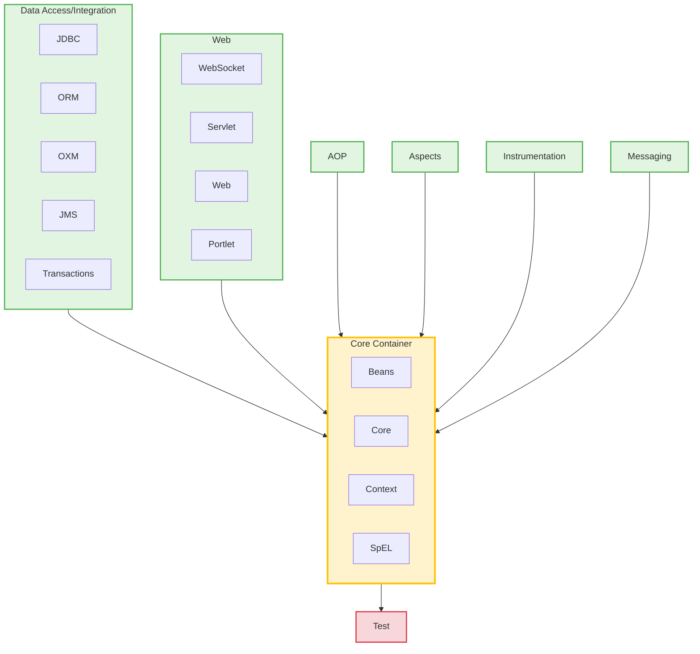

# spring

## spring framework

```mermaid
flowchart TD
    subgraph DA["Data Access/Integration"]
        JDBC["JDBC"]
        ORM["ORM"]
        OXM["OXM"]
        JMS["JMS"]
        Transactions["Transactions"]
    end
    
    subgraph WEB["Web"]
        WebSocket["WebSocket"]
        Servlet["Servlet"]
        WebMVC["Web"]
        Portlet["Portlet"]
    end
    
    AOP["AOP"]
    Aspects["Aspects"]
    Instrumentation["Instrumentation"]
    Messaging["Messaging"]
    
    subgraph CC["Core Container"]
        Beans["Beans"]
        Core["Core"]
        Context["Context"]
        SpEL["SpEL"]
    end
    
    Test["Test"]
    
    %% 连接关系 - 各模块依赖 Core Container
    DA --> CC
    WEB --> CC
    AOP --> CC
    Aspects --> CC
    Instrumentation --> CC
    Messaging --> CC
    CC --> Test
    
    %% 样式设置
    style DA fill:#e1f5e1,stroke:#4caf50,stroke-width:2px
    style WEB fill:#e1f5e1,stroke:#4caf50,stroke-width:2px
    style AOP fill:#e1f5e1,stroke:#4caf50,stroke-width:2px
    style Aspects fill:#e1f5e1,stroke:#4caf50,stroke-width:2px
    style Instrumentation fill:#e1f5e1,stroke:#4caf50,stroke-width:2px
    style Messaging fill:#e1f5e1,stroke:#4caf50,stroke-width:2px
    style CC fill:#fff3cd,stroke:#ffc107,stroke-width:3px
    style Test fill:#f8d7da,stroke:#dc3545,stroke-width:2px
```