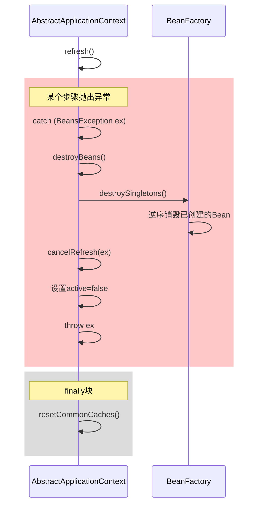

# AbstractApplicationContext.refresh() 方法详细时序图

## 概述

refresh()是ApplicationContext初始化的核心方法，包含13个步骤，本文档详细展示每个步骤的执行流程和时序。

## 完整时序图

```mermaid
sequenceDiagram
    participant Client as 调用者
    participant AAC as AbstractApplicationContext
    participant BF as BeanFactory
    participant BFP as BeanFactoryPostProcessor
    participant BPP as BeanPostProcessor
    participant MS as MessageSource
    participant EM as EventMulticaster
    participant LC as LifecycleProcessor
    
    Client->>AAC: refresh()
    
    rect rgb(240, 248, 255)
    Note over AAC: 步骤1: 准备刷新
    AAC->>AAC: prepareRefresh()
    AAC->>AAC: 设置启动时间
    AAC->>AAC: 设置active=true, closed=false
    AAC->>AAC: initPropertySources()
    AAC->>AAC: validateRequiredProperties()
    AAC->>AAC: 创建earlyApplicationEvents
    end
    
    rect rgb(255, 240, 245)
    Note over AAC,BF: 步骤2: 获取BeanFactory
    AAC->>BF: obtainFreshBeanFactory()
    BF-->>AAC: ConfigurableListableBeanFactory
    end
    
    rect rgb(240, 255, 240)
    Note over AAC,BF: 步骤3: 配置BeanFactory
    AAC->>BF: prepareBeanFactory(beanFactory)
    AAC->>BF: 设置ClassLoader
    AAC->>BF: 设置SpEL解析器
    AAC->>BF: 添加BeanPostProcessor
    AAC->>BF: 忽略Aware接口
    AAC->>BF: 注册可解析依赖
    AAC->>BF: 注册环境Bean
    end
    
    rect rgb(255, 255, 240)
    Note over AAC,BF: 步骤4: 子类扩展点
    AAC->>AAC: postProcessBeanFactory(beanFactory)
    Note right of AAC: Web应用添加request/session作用域
    end
    
    rect rgb(255, 230, 230)
    Note over AAC,BFP: 步骤5: 执行BeanFactory后置处理器（核心）
    AAC->>BFP: invokeBeanFactoryPostProcessors(beanFactory)
    
    BFP->>BFP: ConfigurationClassPostProcessor.postProcessBeanDefinitionRegistry()
    BFP->>BFP: 扫描@Component
    BFP->>BFP: 处理@Configuration
    BFP->>BFP: 处理@Import
    BFP->>BFP: 执行自动配置
    BFP->>BF: 注册所有BeanDefinition
    
    BFP->>BFP: PropertySourcesPlaceholderConfigurer.postProcessBeanFactory()
    BFP->>BF: 配置占位符解析器
    end
    
    rect rgb(230, 230, 255)
    Note over AAC,BPP: 步骤6: 注册Bean后置处理器（核心）
    AAC->>BPP: registerBeanPostProcessors(beanFactory)
    BPP->>BF: 按优先级注册BeanPostProcessor
    Note right of BPP: AutowiredAnnotationBeanPostProcessor<br/>CommonAnnotationBeanPostProcessor<br/>AnnotationAwareAspectJAutoProxyCreator<br/>等等
    end
    
    rect rgb(255, 248, 240)
    Note over AAC,MS: 步骤7: 初始化MessageSource
    AAC->>MS: initMessageSource()
    alt 容器中有messageSource Bean
        AAC->>BF: getBean("messageSource")
        BF-->>MS: MessageSource实例
    else 容器中没有
        AAC->>MS: new DelegatingMessageSource()
        AAC->>BF: 注册为单例Bean
    end
    AAC->>AAC: 设置this.messageSource
    end
    
    rect rgb(240, 255, 255)
    Note over AAC,EM: 步骤8: 初始化事件多播器
    AAC->>EM: initApplicationEventMulticaster()
    alt 容器中有applicationEventMulticaster Bean
        AAC->>BF: getBean("applicationEventMulticaster")
        BF-->>EM: ApplicationEventMulticaster实例
    else 容器中没有
        AAC->>EM: new SimpleApplicationEventMulticaster()
        AAC->>BF: 注册为单例Bean
    end
    AAC->>AAC: 设置this.applicationEventMulticaster
    end
    
    rect rgb(255, 240, 255)
    Note over AAC: 步骤9: 子类扩展点（Web应用创建WebServer）
    AAC->>AAC: onRefresh()
    Note right of AAC: ServletWebServerApplicationContext<br/>创建Tomcat/Jetty/Undertow实例<br/>（但还未启动）
    end
    
    rect rgb(248, 248, 255)
    Note over AAC,EM: 步骤10: 注册监听器
    AAC->>EM: registerListeners()
    AAC->>EM: 添加静态监听器
    AAC->>BF: 获取ApplicationListener Bean名称
    AAC->>EM: 添加监听器Bean名称
    AAC->>EM: 发布早期事件
    end
    
    rect rgb(255, 228, 225)
    Note over AAC,BF: 步骤11: 实例化所有单例Bean（核心）
    AAC->>BF: finishBeanFactoryInitialization(beanFactory)
    BF->>BF: 初始化ConversionService
    BF->>BF: 冻结配置
    BF->>BF: preInstantiateSingletons()
    
    loop 遍历所有BeanDefinition
        BF->>BF: getBean(beanName)
        BF->>BF: 实例化Bean
        BF->>BPP: 属性填充（@Autowired）
        BF->>BPP: Aware接口回调
        BF->>BPP: postProcessBeforeInitialization
        BF->>BF: 初始化方法（@PostConstruct）
        BF->>BPP: postProcessAfterInitialization（AOP代理）
        BF->>BF: Bean就绪
    end
    
    BF->>BF: SmartInitializingSingleton回调
    end
    
    rect rgb(240, 255, 240)
    Note over AAC,LC: 步骤12: 完成刷新（启动WebServer）
    AAC->>AAC: finishRefresh()
    AAC->>AAC: 清理资源缓存
    AAC->>LC: initLifecycleProcessor()
    AAC->>LC: onRefresh()
    Note right of LC: 启动WebServer（Tomcat）<br/>WebServer开始监听端口
    AAC->>EM: publishEvent(ContextRefreshedEvent)
    AAC->>AAC: 注册到LiveBeansView MBean
    end
    
    rect rgb(245, 245, 245)
    Note over AAC: 步骤13: 清理缓存（finally块）
    AAC->>AAC: resetCommonCaches()
    AAC->>AAC: 清理ReflectionUtils缓存
    AAC->>AAC: 清理AnnotationUtils缓存
    AAC->>AAC: 清理ResolvableType缓存
    AAC->>AAC: 清理CachedIntrospectionResults缓存
    end
    
    AAC-->>Client: refresh完成
```



## 各步骤详细说明

### 步骤1: prepareRefresh()

**目的**：准备刷新，初始化基础设施

**关键操作**：
1. 设置启动时间戳
2. 设置容器状态：active=true, closed=false
3. 初始化属性源（由子类实现）
4. 验证必需属性
5. 创建早期事件集合

**时间占比**：< 1%

详见：[AbstractApplicationContext.prepareRefresh](AbstractApplicationContext.prepareRefresh.md)

---

### 步骤2: obtainFreshBeanFactory()

**目的**：获取或创建BeanFactory

**关键操作**：
- SpringBoot：返回已有的DefaultListableBeanFactory
- 传统Spring：重新创建BeanFactory并加载配置

**时间占比**：< 1%

详见：[AbstractApplicationContext.obtainFreshBeanFactory](AbstractApplicationContext.obtainFreshBeanFactory.md)

---

### 步骤3: prepareBeanFactory()

**目的**：配置BeanFactory的标准特性

**关键操作**：
1. 设置ClassLoader和SpEL解析器
2. 添加ApplicationContextAwareProcessor
3. 忽略Aware接口的自动装配
4. 注册可解析依赖（BeanFactory、ApplicationContext等）
5. 注册环境Bean（environment、systemProperties等）

**时间占比**：< 1%

详见：[AbstractApplicationContext.prepareBeanFactory](AbstractApplicationContext.prepareBeanFactory.md)

---

### 步骤4: postProcessBeanFactory()

**目的**：子类扩展点，添加特定配置

**关键操作**：
- Web应用：添加request/session作用域
- 非Web应用：通常为空

**时间占比**：< 1%

详见：[AbstractApplicationContext.postProcessBeanFactory](AbstractApplicationContext.postProcessBeanFactory.md)

---

### 步骤5: invokeBeanFactoryPostProcessors() ⭐⭐⭐

**目的**：处理配置类，注册BeanDefinition

**关键操作**：
1. ConfigurationClassPostProcessor处理配置类
2. 扫描@Component注解的类
3. 处理@Configuration、@Import
4. 执行SpringBoot自动配置
5. 将所有BeanDefinition注册到BeanFactory

**时间占比**：10-15%

详见：[AbstractApplicationContext.invokeBeanFactoryPostProcessors](AbstractApplicationContext.invokeBeanFactoryPostProcessors.md)

---

### 步骤6: registerBeanPostProcessors() ⭐⭐⭐

**目的**：注册Bean后置处理器

**关键操作**：
1. 按优先级获取BeanPostProcessor
2. 实例化并注册：
   - AutowiredAnnotationBeanPostProcessor
   - CommonAnnotationBeanPostProcessor
   - AnnotationAwareAspectJAutoProxyCreator
   - 等等

**时间占比**：5-10%

详见：[AbstractApplicationContext.registerBeanPostProcessors](AbstractApplicationContext.registerBeanPostProcessors.md)

---

### 步骤7: initMessageSource()

**目的**：初始化国际化消息源

**关键操作**：
- 查找名为"messageSource"的Bean
- 如果没有，创建默认的DelegatingMessageSource

**时间占比**：< 1%

详见：[AbstractApplicationContext.initMessageSource](AbstractApplicationContext.initMessageSource.md)

---

### 步骤8: initApplicationEventMulticaster()

**目的**：初始化事件多播器

**关键操作**：
- 查找名为"applicationEventMulticaster"的Bean
- 如果没有，创建默认的SimpleApplicationEventMulticaster

**时间占比**：< 1%

详见：[AbstractApplicationContext.initApplicationEventMulticaster](AbstractApplicationContext.initApplicationEventMulticaster.md)

---

### 步骤9: onRefresh() ⭐⭐

**目的**：子类扩展点，创建特殊Bean

**关键操作**：
- Web应用：创建WebServer实例（Tomcat/Jetty/Undertow）
- 注意：此时WebServer还未启动

**时间占比**：5-10%

详见：[AbstractApplicationContext.onRefresh](AbstractApplicationContext.onRefresh.md)

---

### 步骤10: registerListeners()

**目的**：注册应用监听器

**关键操作**：
1. 注册静态指定的监听器
2. 注册容器中的ApplicationListener Bean
3. 发布早期事件

**时间占比**：< 1%

详见：[AbstractApplicationContext.registerListeners](AbstractApplicationContext.registerListeners.md)

---

### 步骤11: finishBeanFactoryInitialization() ⭐⭐⭐

**目的**：实例化所有非懒加载的单例Bean

**关键操作**：
1. 初始化ConversionService
2. 冻结BeanDefinition配置
3. 遍历所有BeanDefinition，实例化Bean
4. 执行Bean的完整生命周期
5. 触发SmartInitializingSingleton回调

**时间占比**：50-60%（最耗时）

详见：[AbstractApplicationContext.finishBeanFactoryInitialization](AbstractApplicationContext.finishBeanFactoryInitialization.md)

---

### 步骤12: finishRefresh() ⭐⭐⭐

**目的**：完成刷新，启动WebServer

**关键操作**：
1. 清理资源缓存
2. 初始化LifecycleProcessor
3. 调用LifecycleProcessor.onRefresh()（**启动WebServer**）
4. 发布ContextRefreshedEvent事件
5. 注册到LiveBeansView MBean

**时间占比**：10-15%

详见：[AbstractApplicationContext.finishRefresh](AbstractApplicationContext.finishRefresh.md)

---

### 步骤13: resetCommonCaches()

**目的**：清理内省缓存，释放内存

**关键操作**：
1. 清理ReflectionUtils缓存
2. 清理AnnotationUtils缓存
3. 清理ResolvableType缓存
4. 清理CachedIntrospectionResults缓存

**时间占比**：< 1%

详见：[AbstractApplicationContext.resetCommonCaches](AbstractApplicationContext.resetCommonCaches.md)

---

## 异常处理流程

如果refresh过程中发生异常：



详见：
- [AbstractApplicationContext.destroyBeans](AbstractApplicationContext.destroyBeans.md)
- [AbstractApplicationContext.cancelRefresh](AbstractApplicationContext.cancelRefresh.md)

## 核心步骤优先级

| 优先级 | 步骤 | 重要性 | 说明 |
|--------|------|--------|------|
| ⭐⭐⭐ | 5 | 极高 | 注册BeanDefinition，决定哪些Bean会被创建 |
| ⭐⭐⭐ | 6 | 极高 | 注册BeanPostProcessor，决定Bean如何被处理 |
| ⭐⭐⭐ | 11 | 极高 | 实例化Bean，最耗时的步骤 |
| ⭐⭐⭐ | 12 | 极高 | 启动WebServer，应用开始可用 |
| ⭐⭐ | 9 | 高 | 创建WebServer实例 |
| ⭐⭐ | 8 | 中高 | 初始化事件机制 |
| ⭐ | 1-4, 7, 10, 13 | 中低 | 基础设施和辅助功能 |

## 性能优化建议

### 减少Bean数量
```java
// 使用懒加载
@Lazy
@Component
public class HeavyService {
    // ...
}
```

### 优化自动配置
```properties
# 排除不需要的自动配置
spring.autoconfigure.exclude=\
  org.springframework.boot.autoconfigure.jdbc.DataSourceAutoConfiguration
```

### 使用条件注解
```java
@Configuration
@ConditionalOnProperty(name = "feature.enabled", havingValue = "true")
public class FeatureConfig {
    // 只在需要时加载
}
```

## 相关文档

- [Spring Boot启动流程图](spring-boot-startup-flow.md)
- [Application.refreshContext](Application.refreshContext.md)
- [返回README](README.md)

