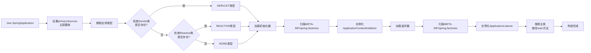
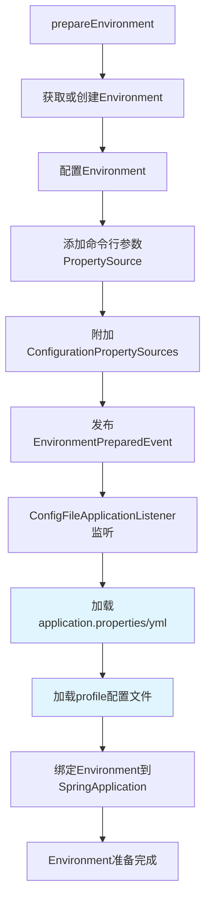
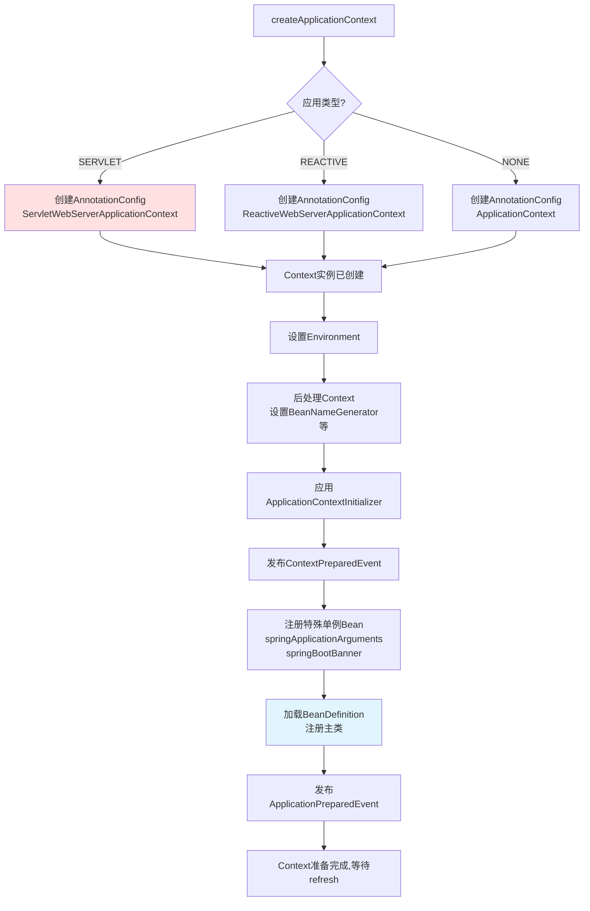
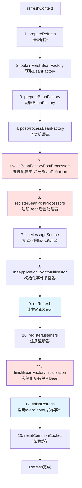
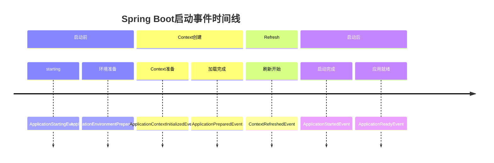

# Spring Boot 启动流程图

## 整体启动流程

```mermaid
flowchart TD
    Start[main方法] --> CreateApp[创建SpringApplication]
    CreateApp --> DeduceType[推断应用类型<br/>SERVLET/REACTIVE/NONE]
    DeduceType --> LoadInitializers[加载ApplicationContextInitializer]
    LoadInitializers --> LoadListeners[加载ApplicationListener]
    LoadListeners --> DeduceMain[推断主类]
    
    DeduceMain --> Run[调用run方法]
    
    Run --> StartTimer[启动计时器]
    StartTimer --> ConfigHeadless[配置Headless属性]
    ConfigHeadless --> GetRunListeners[获取SpringApplicationRunListeners]
    GetRunListeners --> Starting[发布ApplicationStartingEvent]
    
    Starting --> PrepareEnv[准备Environment]
    PrepareEnv --> EnvPrepared[发布EnvironmentPreparedEvent]
    EnvPrepared --> PrintBanner[打印Banner]
    
    PrintBanner --> CreateContext[创建ApplicationContext]
    CreateContext --> PrepareContext[准备Context]
    PrepareContext --> ContextPrepared[发布ContextInitializedEvent]
    ContextPrepared --> LoadSources[加载Bean源<br/>注册主类为BeanDefinition]
    LoadSources --> ContextLoaded[发布ApplicationPreparedEvent]
    
    ContextLoaded --> RefreshContext[刷新Context<br/>13个步骤]
    RefreshContext --> AfterRefresh[afterRefresh<br/>空方法,子类扩展]
    AfterRefresh --> StopTimer[停止计时器]
    StopTimer --> Started[发布ApplicationStartedEvent]
    
    Started --> CallRunners[调用ApplicationRunner<br/>和CommandLineRunner]
    CallRunners --> Running[发布ApplicationReadyEvent]
    Running --> End[应用就绪,可接受请求]
    
    style CreateContext fill:#e1f5ff
    style RefreshContext fill:#ffe1e1
    style End fill:#e1ffe1
```

## SpringApplication构造过程

## Environment准备过程

## Context创建和准备

## Refresh过程（13步）

## 关键步骤说明

### 核心步骤（必须关注）

1. **invokeBeanFactoryPostProcessors（步骤5）**
   - 扫描包路径，查找@Component等注解
   - 处理@Configuration配置类
   - 执行SpringBoot自动配置
   - 将所有BeanDefinition注册到BeanFactory

2. **registerBeanPostProcessors（步骤6）**
   - 注册各种BeanPostProcessor
   - 为后续的Bean实例化做准备

3. **onRefresh（步骤9）**
   - Web应用创建WebServer实例（Tomcat/Jetty/Undertow）
   - 但此时还未启动

4. **finishBeanFactoryInitialization（步骤11）**
   - 实例化所有非懒加载的单例Bean
   - 执行依赖注入
   - 应用AOP代理

5. **finishRefresh（步骤12）**
   - 启动WebServer
   - 发布ContextRefreshedEvent事件
   - 应用开始可以接受请求

### 事件发布时间线

## 启动性能分析

典型的Spring Boot应用启动时间分布：

| 阶段 | 耗时占比 | 说明 |
|------|----------|------|
| 准备阶段 | 5% | 创建SpringApplication、加载配置 |
| 创建Context | 5% | 创建ApplicationContext实例 |
| 注册BeanDefinition | 15% | 扫描类、处理注解 |
| 实例化Bean | 60% | 创建Bean实例、依赖注入 |
| 启动WebServer | 10% | 启动Tomcat等 |
| 其他 | 5% | 发布事件、调用Runner等 |

**优化建议**：
- 减少Bean的数量（懒加载）
- 优化依赖关系（避免循环依赖）
- 使用Spring Boot DevTools（开发环境）
- 考虑使用Spring Native（生产环境）

## 相关文档链接

- [Application.run详解](Application.run.md)
- [Application.createApplicationContext](Application.createApplicationContext.md)
- [Application.refreshContext](Application.refreshContext.md)
- [refresh方法时序图](refresh-sequence-diagram.md)

