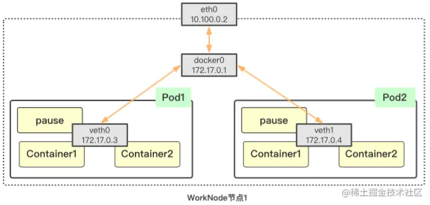
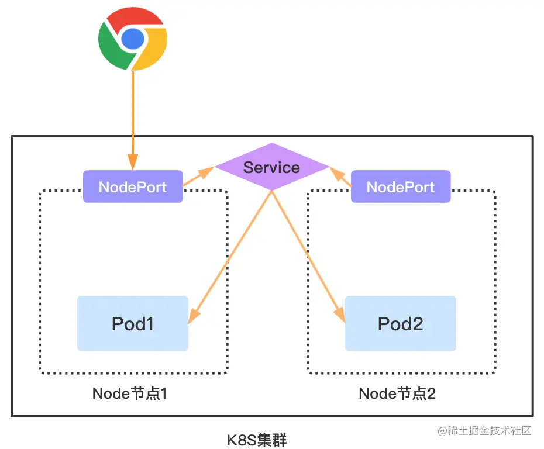
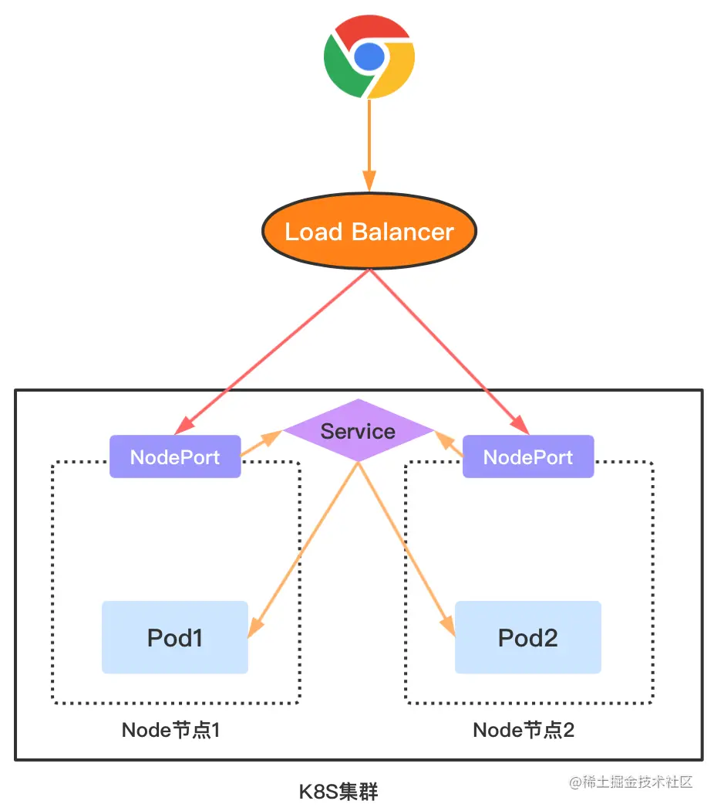
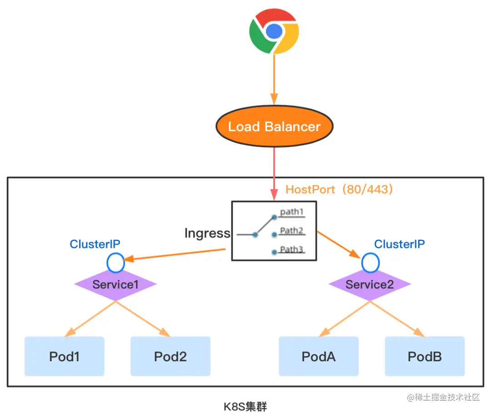

# K8S网络架构

## Node网络

## Pod网络

## 同一个Pod不同容器之间的网络互通

## 同一个Node节点不同Pod之间网络互通

## Service的ClusterIP网络模型

## Service的ClusterIP注册发现

## 外部流量接入

### NodePort

### LB+NodePort

### LB+Ingress

## 总结

